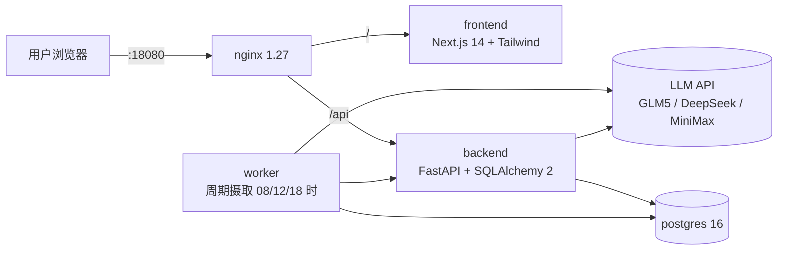

# Biomed News — 细胞疗法新闻与情报聚合平台

> 面向细胞与基因疗法（CGT）赛道研究者的每日情报看板：自动抓取生物医药新闻 → LLM 分类与打分 → 中文每日摘要 → 产品管线时间线 → 企业动态监控。

线上预览（仅供测试）：<http://118.178.195.6:18080/>

---

## 核心能力

| 模块 | 一句话概括 |
|---|---|
| 🗞️ **今日摘要** | 抓取 RSS/NewsAPI/PubMed/ClinicalTrials 等源的生物医药新闻，GLM5/DeepSeek/MiniMax 任选打分并写一份中文行业摘要 |
| 💊 **产品动态 (Products)** | 输入一个细胞疗法代号（甚至尚未上市的内部开发代号），自动扩展别名、扫描 PubMed + CT.gov 构建从 IND/IIT → 临床 I/II/III → 获批/商业化的里程碑时间线 |
| 🏢 **企业动态** | 对 45+ 家细胞疗法头部公司，按「裁员·重组 / 新管线·IND / 融资·估值」三类信号持续聚合 |

---

## 技术栈



- 部署：Docker Compose；backend / worker 源码**bind-mount**，日常 Python 改动无需 rebuild，重启即可（~5 秒）
- LLM：通过上海交大 SJTU API 网关调用 `glm-5` / `deepseek-chat` / `deepseek-reasoner` / `minimax-m2.5`
- 运行环境：小内存 VPS（1.8 GB RAM + 2 GB swap）也可承载全栈

---

## 架构与目录

```
biomed-news-app/
├── backend/
│   ├── app/
│   │   ├── api/routes.py            # 所有 REST 端点
│   │   ├── core/                    # 配置、分类枚举
│   │   ├── db.py, models/           # SQLAlchemy models
│   │   ├── schemas/                 # Pydantic (响应 + LLM 抽取)
│   │   └── services/
│   │       ├── ingestion.py         # 抓取 → 富化 → 总结 的顶层 orchestrator
│   │       ├── sources.py           # RSS/API 源实现
│   │       ├── enrichment.py        # 单条新闻富化（LLM + fallback）
│   │       ├── news_repository.py   # 列表/筛选/去重 + 相关度闸门
│   │       ├── summary.py           # 每日摘要生成 + 幂等 upsert
│   │       ├── glm5_client.py       # LLM 客户端 + 限流 + JSON 恢复
│   │       ├── product_tracking.py  # Products 回填（PubMed + CT.gov + 别名挖掘）
│   │       ├── drug_aliases.py      # 静态同义词表 + LLM 兜底 + alnum 归一化
│   │       ├── corporate_dynamics.py# 公司匹配 + 信号关键词
│   │       └── database_init.py     # 幂等 ALTER TABLE 迁移
│   ├── worker/run_worker.py         # 周期 ingestion 入口
│   ├── config/
│   │   ├── sources.json             # RSS/API 源清单
│   │   ├── drug_synonyms.json       # 21 组知名 CAR-T/CGT 药物同义词
│   │   └── cell_therapy_companies.json  # 46 家公司（含中英别名）
│   └── scripts/reenrich_news.py     # 用新 prompt 重新打分历史数据
├── frontend/
│   ├── app/
│   │   ├── page.tsx                 # 今日摘要
│   │   ├── products/…               # 产品列表 & 详情
│   │   └── corporate-dynamics/page.tsx
│   └── components/
│       ├── top-nav.tsx              # 三个 pill 按钮共用
│       ├── dashboard.tsx
│       ├── product-tracker.tsx
│       ├── product-timeline.tsx
│       └── corporate-dynamics.tsx
├── infra/nginx/default.conf
├── scripts/deploy.sh                # 快部署（rsync + bind-mount restart）
└── docker-compose.yml
```

---

## 🗞️ 新闻抓取 + 富化 + AI 总结

### 1. 抓取（ingestion）

入口：`backend/app/services/ingestion.py::run_ingestion_cycle`，由 worker 按 `INGESTION_SCHEDULE_HOURS`（默认 8/12/18 点）触发，或 `POST /api/admin/refresh` 手工触发。

- 源清单读自 `backend/config/sources.json`（RSS 聚合 + NewsAPI + PubMed 关键词查询）
- 对每个源：`fetch` → `normalize` → 去重（canonical URL + 标题相似度）→ 落盘 `news_items`
- 每源独立 try/except + 指数退避重试（`SOURCE_REQUEST_MAX_ATTEMPTS=3`）
- 一轮结束后产出 `IngestionResult(fetched/normalized/inserted/updated/duplicates)`

### 2. 富化（enrichment）

`services/enrichment.py::enrich_items`：

- LLM 路径：`GLM5Client.enrich_item`，按严格 prompt 输出
  ```json
  {
    "one_line_summary": "...",
    "category": "R&D | Clinical/Regulatory Progress | Manufacturing/CMC | Financing | Partnership/Licensing | M&A/Organization | Policy/Industry Environment | Other",
    "entities": ["BCMA", "JCAR017"],
    "importance_score": 0.0~1.0,
    "relevance_to_cell_therapy": 0.0~1.0
  }
  ```
- prompt 中内置严格评分规则 + 10 条明确 REJECT 示例（小分子、ADC、psychedelics、alopecia、CDK4/6、biosimilar…）
- **硬规则**：若 `relevance_to_cell_therapy < 0.7` → category 强制为 `Other`
- Fallback 路径：LLM 失败时走 `fallback_relevance`
  - 命中 `CELL_THERAPY_STRONG_TERMS`（CAR-T/CAR-NK/TCR-T/TIL/iPSC/Treg/CGT 等 50+ 词）→ 0.85–0.9
  - 命中 `CELL_THERAPY_CONTEXT_TERMS`（viral vector, CDMO, leukapheresis 等）→ 0.55
  - 命中 `NON_CELL_MODALITY_TERMS` 且无强 CGT 词 → **强制 0.1**（硬下限）
- 结果写回 `news_items`，并触发企业动态打标（见下）

### 3. 列表闸门（list_news gate）

`news_repository.list_news`：

- 默认未传 `category` 时强制 `relevance_to_cell_therapy >= 0.7 AND category != 'Other'`
- 显式传 category（包括 `Other`）则尊重用户选择 → 实现"默认清爽 + 需要时回溯"
- `category_counts` 也走同一闸门，分类徽章数字与实际列表一致

### 4. 每日摘要（daily summary）

`services/summary.py::generate_daily_summary`：

- 取当天 `news_items` → `GLM5Client.summarize_day`
- **强制中文 system prompt**：JSON key 保持英文，描述性字段全部简体中文；药物代号/基因/NCT 编号等专业术语保留原文
- 输出：`daily_summary` + `top_events[3-5]` + `trend_signal` + `category_summaries` + `category_counts`
- 幂等 upsert 到 `daily_summaries(summary_date)`
- 关键不变量：**regenerate 流程不得重新富化 news_items**（否则切模型会让已可见新闻消失）

### 5. 模型切换

前端模型选择器调 `POST /api/summary/regenerate?model=xxx`，不触碰 `news_items`，仅覆盖 `daily_summaries`。

---

## 💊 产品动态（Products）

核心流程：`backend/app/services/product_tracking.py`

### 追踪一款产品的全链路

```
用户输入 display_name + company + aliases + indications + modality
              │
              ▼
   ┌─ drug_aliases.expand_aliases ────────────────────┐
   │  1. 查 drug_synonyms.json（21 组知名药）          │
   │  2. 命中 → 返回完整组（Abecma ↔ bb2121 ↔ ide-cel）│
   │  3. 未命中（≤2 条）→ 调 GLM5 兜底                 │
   │     confidence ≥ 0.6 才采纳，失败不阻塞创建       │
   └───────────────────────────────────────────────────┘
              │
              ▼   alnum-key 去重查重
   ┌─ get_tracked_product_by_alnum_key ───────────────┐
   │  "AZD-0120" vs "azd0120" vs "AZD 0120" 同一组     │
   │  已存在 → 409 duplicate_product                   │
   └───────────────────────────────────────────────────┘
              │
              ▼
   POST /api/products/{id}/backfill（202 Accepted, 后台执行）
              │
              ▼   threading.Timer(180s) watchdog
   ┌─ backfill_product_timeline ──────────────────────┐
   │  A. _fetch_external_candidates                    │
   │     ├── PubMed E-utilities (esearch + esummary)   │
   │     └── ClinicalTrials.gov v2 (query.intr)        │
   │     每源独立 try/except，一个挂不影响另一个        │
   │                                                   │
   │  B. harvest_ctgov_aliases                         │
   │     从 CT.gov interventions[].name + otherNames   │
   │     过滤黑名单（cyclophosphamide、fludarabine、    │
   │     placebo、standard of care、local anesthetics…) │
   │     只用"像药物代号"的 alias 精确查询              │
   │     新别名并入 product.aliases → 重跑匹配一次      │
   │                                                   │
   │  C. _match_news_to_product                        │
   │     alnum-key 子串匹配（忽略大小写和横杠）         │
   │     兜底调 LLM 判 is_relevant 返回 confidence      │
   │                                                   │
   │  D. _extract_timeline_events                      │
   │     GLM5 抽取里程碑 JSON：                         │
   │       event_date / precision / milestone_type /   │
   │       phase_label / headline / summary /          │
   │       indication / region / confidence            │
   │     LLM 返回空 events[] → 走关键词 fallback        │
   │                                                   │
   │  E. 更新 product.backfill_status ∈                │
   │       idle / running / done / failed              │
   │     + backfill_error:                             │
   │       no_candidates / no_linked_news /            │
   │       no_timeline_events / deadline exceeded      │
   └───────────────────────────────────────────────────┘
```

### 里程碑分类

`milestone_type ∈ { research, preclinical, ind_cta_iit, phase_start, phase_result, regulatory, partnering, financing, setback, commercial, other }`

`event_date_precision ∈ { year, month, day }` — 保真度透明化

### 前端体验

- 列表卡片：状态徽标（`⏳ 回填中 (N 分钟)` / `✓ 已回填` / `⚠ 未找到事件` / `✗ 失败`）+ hover 垃圾桶 DELETE 按钮
- 任何卡片处于 `running` 时自动每 5 秒轮询整个列表，直到全部终态
- 详情页：按时间倒序的垂直时间线（apple-blue 圆点 + ring），证据链接显示 host 名（`pubmed.ncbi.nlm.nih.gov ↗`）
- 回填首次运行：后台 ≤180s 硬截断，用户永远不会看到永远卡住的"running"

---

## 🏢 企业动态（Corporate Dynamics）

核心模块：`backend/app/services/corporate_dynamics.py`

### 数据来源
零新爬虫 — 完全复用 `news_items`。

### 公司匹配

- 公司名单 `backend/config/cell_therapy_companies.json` 共 **46 家**（Novartis / Kite / BMS / Legend / CARsgen / IASO / Fosun Kairos / Vertex / Allogene / Bluebird / CRISPR Tx / Intellia / Beam / Sana / Fate / …）
- 每家含 `name`、`chinese_name`、`aliases: [...]`（中英双语、旧名、品牌名）
- 匹配函数 `match_company(text)`：alnum-key 归一化 + 子串匹配（和 product_tracking 同套）
- 入库阶段在 `enrichment.enrich_items` 末尾调用，结果写 `news_items.company_name`

### 信号检测

三类桶，关键词混合中英（示例）：

| 信号 | 关键词（片段） |
|---|---|
| `layoffs` | layoff, restructuring, workforce reduction, shut down, wind down, discontinue, 裁员, 重组, 关停, 削减, 停止开发 |
| `new_pipeline` | new IND, IND approval, IND cleared, first patient dosed, first-in-human, pipeline expansion, 新管线, IND获批, 首例给药, 首次人体 |
| `financing` | Series A/B/C/D, IPO, valuation, raised, fundraise, 融资, 上市, 估值, 募资, 轮融资 |

- `detect_corporate_signals(text)` 返回命中的桶名列表（一条新闻可同时命中多类）
- 写入 `news_items.corporate_signals` (JSONB)

### API 与前端

- `GET /api/corporate-dynamics?signal=layoffs&company=Novartis`
  - 返回 `{companies: [{name, chinese_name, signals: {layoffs: [...], ...}, last_updated_at}], total_companies}`
  - 按最近信号时间降序
- 前端 `/corporate-dynamics`：顶部 pill 过滤（全部 / 裁员·重组 / 新管线·IND / 融资·估值）+ 可搜索公司卡片 + 每家公司按信号桶分层展示

---

## 运行指南

### 本地 dev

```bash
# 1. 复制并填写密钥
cp .env.example .env
# 至少填：POSTGRES_PASSWORD、GLM5_API_KEY、ADMIN_REFRESH_TOKEN

# 2. 启动全栈
docker compose up -d --build

# 3. 访问
open http://localhost:8080
```

前端 hot reload（可选）：`cd frontend && npm install && npm run dev`（端口 3000）。

### 生产部署（快路径）

```bash
# 把 backend/frontend/nginx 同步到服务器并启动对应服务
bash scripts/deploy.sh backend frontend nginx

# 只改了后端 Python 代码（不动依赖）？
bash scripts/deploy.sh backend    # ~5 秒
```

- bind-mount 后端源码，Python 改动无需 rebuild
- 依赖或 Dockerfile 变更时加 `REBUILD=1`
- nginx 配置改动走 `reload` 不重启

### 重新打分历史数据

改了分类阈值或关键词表后：

```bash
ssh root@<server> "cd /opt/biomed-news-app && \
  docker cp backend/scripts/reenrich_news.py biomed_news_backend:/app/reenrich_news.py && \
  docker compose exec -T backend python /app/reenrich_news.py --all"
```

---

## API 速查

| 方法 | 路径 | 说明 |
|---|---|---|
| GET | `/api/news` | 新闻列表（默认闸门：rel≥0.7 且非 Other） |
| GET | `/api/news/today-summary` | 当日中文摘要 |
| POST | `/api/summary/regenerate?model=X` | 换模型重生成摘要 |
| GET | `/api/products` | 已追踪产品列表 |
| POST | `/api/products` | 新建产品（静态同义词 + LLM 兜底 + 查重） |
| DELETE | `/api/products/{id}` | 删除产品 |
| GET | `/api/products/{slug}` / `/timeline` / `/sources` | 详情/时间线/证据源 |
| POST | `/api/products/{id}/backfill` | 触发异步回填（202） |
| GET | `/api/corporate-dynamics` | 企业动态（可按 signal、company 过滤） |
| POST | `/api/admin/refresh` | 手动触发一轮摄取（需 X-Admin-Token） |
| GET | `/api/models` | 可用模型清单 |
| GET | `/api/health` | 健康检查 |

---

## 关键配置

`.env` / `docker-compose.yml` environment：

- `GLM5_MODEL_NAME` — 默认 LLM（glm-5 / deepseek-chat / deepseek-reasoner / minimax-m2.5）
- `GLM5_REQUEST_TIMEOUT_SECONDS` — 单次 LLM 超时（默认 300）
- `INGESTION_SCHEDULE_HOURS` — worker 调度（默认 8,12,18）
- `INGESTION_MAX_ITEMS_PER_SOURCE` — 每源每轮上限（默认 12）
- `SEED_SAMPLE_DATA` — 启动时注入示例数据（默认 false）
- `ADMIN_REFRESH_TOKEN` — 管理员刷新接口的口令

---

## 可扩展方向

- 新源：在 `backend/config/sources.json` 加一条即可（支持 RSS / Atom / NewsAPI / 自定义 fetcher）
- 新同义词：编辑 `backend/config/drug_synonyms.json` 加一行组
- 新公司：编辑 `backend/config/cell_therapy_companies.json`
- 新信号桶：在 `corporate_dynamics.CORPORATE_SIGNAL_RULES` 加键值对即可被 API 返回

---

## 授权

内部研究工具。源码保留，商用请先联系仓库拥有者。

生成与维护：[Claude Code](https://claude.com/claude-code) (Opus 4.7, 1M context)
